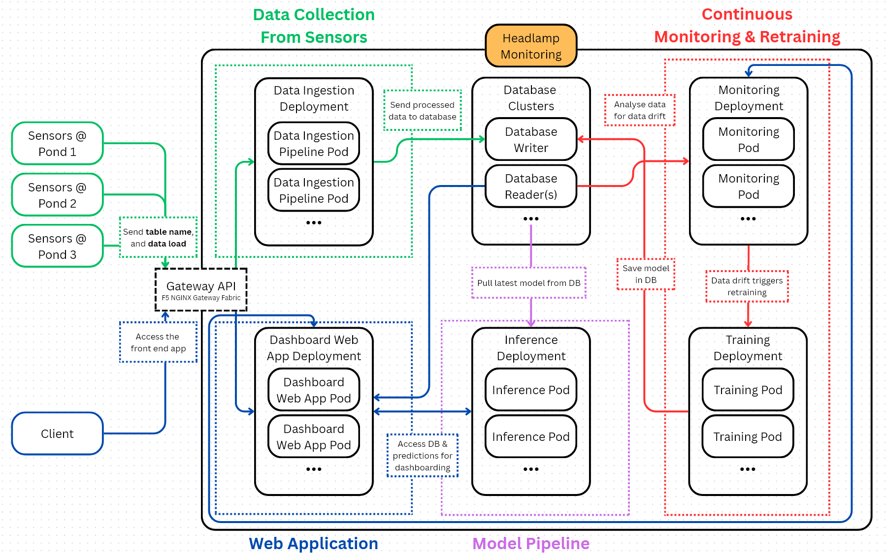

# AquaBoard

# Project Members

### 231725Z - Darren Foo Tun Wei
### 230649F - Matthew Christopher Tan Ming Wen
### 232842C - Zhang Zhexiang
### 231606H - Pinili Johan Matthew Valdez

# Directory Structure

```
.
├── README.md
├── deployment
|   └── Dockerfiles
├── k8s
|   └── base
|       └── k8s manifests
└── apps
    └── database_app
        ├── src
        |   └── Your source code.py
        ├── test
        |   └── Your test code.py
        └── requirements.txt
```

# Project Objectives

The goal of AquaBoard is the consolidation of real-time sensor data streams in aquaponics systems.

With the onset of Singapore's goal of self-sufficiency, vertical farming methods such as aquaponics and hydroponics are increasingly relevant. This is due to the lack of land area for traditional farming methods. Hence, this project aims to supplement current and future vertical farming infrastructure through the data science. Namely, allowing for the consolidation, presentation, and analysis of data.

This project leverages Kubernetes architecture to create a scalable, available, and fault tolerant unerlying system.

# Execution Instructions

## Step 1: Prerequisite software

Requires **docker & minikube** to run and host the kubernetes cluster.

## Step 2: Installation of packages

### LINUX
1. Install required packages
```shell
# Required
sudo apt install postgresql build-essential

# For converting to unix format
sudo apt install dos2unix
```

### MAC:
1. Install required packages
```shell
# Required
brew install gettext postgresql
xcode-select --install

# For converting to unix format
brew install dos2unix
```

## Step 3: Setting up environment variables

1. Create a file named `.env` in the base directory
2. Fill in values for `POSTGRES_PASS` and `ML_POSTGRES_PASS`. These will be the passwords that will be used for the admin accounts of the databases.
```.env
# Example
POSTGRES_PASS=password
ML_POSTGRES_PASS=password
```

## Step 4. Using Makefile to build the application

Use the `Makefile` to create the all the deployments of the cluster. Ensure you have docker.service daemon running and are running commands from the base directory.

Sometimes the bash scripts will be in dos format, making them unable to be run. If this is the case, run the following command, which will convert all the bash scripts in the `./scripts` directory into unix format.
```shell
make fix-scripts
```

1. Run `make start-minikube`. This will start minikube with maximum allotments for --cpus and --memory. If you want to set a custom resource allotment, simply use the `minikube start --cpus=n --memory=n`. Note that it is recommended to use at least 8gb (8000) of RAM to ensure the cluster can run smoothly.
```shell
# Max CPUs and RAM allocations
make start-minikube

# Custom resource allotment
minikube start --cpus=X --memory=X
```

2. Run `make` to set up the entire cluster. This might take a while
```shell
make
```

3. Run `make minikube-tunnel` to create a tunnel from localhost to the Nginx GatewayAPI for accessing the dashboard, ingestion, endpoint, and the monitoring reports.
```shell
make minikube-tunnel
```

4. Run `make headlamp-service` in another terminal to create a tunnel from localhost to the headlamp NodePort.
```shell
make headlamp-service
```

5. In order to access the headlamp UI, you need to generate the headlamp token
```shell
make headlamp-token
```

## Step 5. Populating databases for testing

The `Makefile` includes extra scripts to populate the postgres databases.

1. Populating the sensor database with data from this Kaggle dataset (Ogbuokiri, 2023). This will create a k8s Job that downloads the dataset and uploads it into the sensor database
```shell
make upload-data
```

2. Populating the model artifacts database. Note that data needs to be uploaded into the database before models can be trained.
```shell
# Method 1: Force run the monitoring cronjob to trigger model retraining
kubectl create job -n monitoring-job-ns --from=cronjob/monitoring-scheduled-job test

# Method 2: Create the training job (from base directory)
kubectl apply -f ./k8s/training/training-jobs.yaml -l component=ml-force-train-job
```

## Step 6. Manual Model Inference
Typically, the model will automatically perform data forecasting every hour. However, if you want to trigger the data forecasting immediately, you can create a job based on the scheduled inference cronjob.
``` shell
# Force run the inference cronjob to trigger model inference
kubectl create job -n dashboard-ns --from=cronjob/inference-scheduled-job inference-job
```
The model will then perform data inference which can take a few minutes.

# System Architecture



## Microservice - Ingestion Pipeline

...

## Microservice - PostgreSQL Database Clusters

### Explanation

The database is built on the open-source object-relational database system know as PostreSQL and is used for storing the collected sensor data and machine learning model artifacts. There are two  database clusters with separate users, tables, and permissions, one for sensor data and one for ML model artifacts.

The databases use a fault-tolerant and scalable architecture known as Read/Write Splitting. It consists of one writer database and N reader databases (in this case, the database is set up with 2 reader database instances). The readers replicate the data stored in the writer database, it serving as the single source of truth for the entire database cluster. This is very useful in read-heavy applications like this one since it prevents the overloading of the writer database when only querying information from the database.

When the writer fails, the remaining replicas (readers) hold an election to decide who is the most up-to-date. The reader that wins this election is then promoted to become the new writer database. The old writer database is then forcefully deleted and cut off (to prevent the split-brain problem) and the database cluster carries on normal operations with a new writer while the old writer pod is killed, reset and restarted as a reader pod.

In order to achieve this, the solution uses the CloudNativePG operator to handle the Read/Write Splitting logic between the pods in the database cluster. Both the sensor and ML database use this operator.

### Functionality

Inside the Kubernetes cluster, the **sensor database** is connected to every microservice through the `sensor-db-ha-rw.database-ns:5432` while the ML artifacts database is connected to the inference and training applications through `ml-artifacts-db.ml-artifacts-db-ns:5432` (ClusterIPs).

Alongside storing data, they also store the `procrastinate` queues for the training and monitoring application backends, which is explained their respective sections. 

Given that the databases are based on PostgreSQL, they can be accessed using the `psql` CLI tool, `pgAdmin` application, or the `SQLAlchemy` or `psycopg2` python libraries. These python libraries are also used as the main database access mechanism for all the downstream applications. The database is queries. 

### Miscellaneous

The `k8s\database\sensor-database\postgres-data-loader.yaml` and `k8s\database\sensor-database\postgres-job-configmap.yaml` are used to upload the Kaggle dataset into the database within the Kubernetes cluster via a Job.
 
## Microservice - Training Pipeline

### Explanation
The training pipeline is designed to be a distributed, asynchronous system responsible to automate the retraining of LSTM (Long Short-Term Memory) models using historical sensor data. in order to maintain high availability and system responsiveness, the architecture decouples the task scheduling from the training workers (A seperate container instance of the training pipeline).

This is achieved with `Procrastinate`, a PostgreSQL-based task queue that manages job distribution. Training jobs can be injected into the task queue via two mechanisms: `cronjobs` or via `API`. Once jobs are queued, independent training workers can execute these jobs. This design, coupled with `HPA` allows the system to scale the number of training workers horizontally if there is an influx of training jobs.

### Functionality

The training pipeline consists of three functional components within the Kubernetes cluster:
1. Training scheduler (triggered via API/Cronjob): This dispatches training tasks to the queue and can be triggered via `FastAPI` or a `Cronjob`
2. Training pipeline (Procrastinate workers): Gets jobs from the training queue, performs ETL on sensor data and trains the LSTM timeseries models
3. ML Artifacts database (PostgreSQL database): Stores model training artifacts for inferenece usage

Inside the cluster, the training workers extracts data from the sensor database via `sensor-db-ha-rw.database-ns:5432` and writes model artifacts to the ML database via `ml-artifacts-db-rw.ml-artifacts-db-ns:5432` (ClusterIPs).

### Kubernetes Orchestration

1. Horizontal Pod Autoscaler (HPA): HPA is utilized to monitor CPU usage. It is utilized to conserve compute resource and allocate more resources for training when required.
2. Database Schema upload (job): The kubernetes job `ml-db-setup` is used to used to initialize the database and procrastinate schema in the `ml-artifacts-db` PostgreSQL database, ensuring that the environment is ready before the training workers are initialized.
3. Automated training (Cronjob): The `ml-periodic-trigger` cronjob trains models periodically (in this case 20 minutes). This ensures that the LSTM models are consistently updated with the most recent data.
4. Security (Reflectors): Database credentials is injected into the pods via `Secrets` mirrored by the `Emberstack Reflector`
5. Configurations (ConfigMap): Environemt specific variables are managed via `ConfigMap`.

## Microservice - Monitoring Application

### Explanation

The monitoring application is designed to detect data drift within the database by taking the first X rows and comparing it with the next Y rows (e.g. Compare first 5,000 rows against the next 5,000 rows).

It also includes a graphical user interface to allow access to the generated "data drift reports" which are documents that detail information such as the number of drifted columns, Population Stability Index scores for each column, and percentage of drifted columns.

### Functionality

The monitoring application consists of three main "ends":
1. Frontend deployment (Data drift reports UI)
2. Middleend deployment (Dealing with API calls to the backend)
3. Backend deployment (Generating data drift reports and call retraining pipeline)

The Frontend deployment deals with the GUI of the monitoring application, allowing users to access and download the generated data drift reports using Evidently UI.

The Middleend deployment serves as the middleman between inbound requests and the backend which actually does the report generation. When a POST API request comes into the Middleend, it formats it and adds the job to a `procrastinate` queue inside the PostgreSQL database. It then sends a 200_OK status code to the requester and waits for the next request.

The Backend deployment deals with data drift detection and report generation. It listens to the `procrastinate` queue and when it receives a job (containing the required data payload), it generates a data drift report. Data drift is measured using the Population Stability Index test. If more than X% of the columns have data drift, the backend will send a request to the training pipeline to retrain the existing model.

## Miscellaneous

The monitoring for data drift is a requires a task that is scheduled in regular intervals. A CronJob is used to schedule this report generation, and it is run every day at midnight. In order to prevent large data spikes at midnight (especially when there are a lot of tables), the CronJob creates an IndexedJob that breaks down the generation into groups of X (as configured in the job ConfigMap). The IndexedJob creates a job that sends a request to the monitoring API. This helps to leverage on the scalability of Kubernetes deployments while also not overloading the monitoring middleend API.

## Microservice - Inference Pipeline


## Microservice - Dashboard Application

### Explanation

The dashboard application serves as a way for farmers to understand the current pond data and the forecasted data through meaningful and simple visualizations. The dashboards consists of 3 different pages:

 - A **main overview page** where the latest pond data from each pond is shown accompanied with an arrow indicating the future trend of the data
 - A **secondary overivew page** visualizing each data column with line charts displaying the median, mean and max of all the pond data for each column
 - A **dedicated pond page** for each pond in the database showcasing the latest data values as well as a line graph for each column showing the current and forecasted data.


### Functionality

The dashboard application mainly consists of a  deployment acting as a frontend and backend.

In terms of the frontend, the data visuals are mostly created using a python framework called Streamlit for the dashboard layout and majority of the graphs. Additionally, Altair is used for more complicated data visualizations.

For the backend, the latest pond data is retrieved from the PostgreSQL database with the use of SQLAlchemy. To obtain the model inference data, a cronjob is used to send a request periodically to the inference deployment. The model inference outputs are then saved as a JSON file in a Persistent volume for the dashboard deployment to retrieve and display.


## Microservice - GatewayAPI

### Explanation

GatewayAPI is the modern, official Kubernetes standard for managing how external traffic gets routed to the applications inside the Kubernetes cluster. I opted to use this instead of Ingress because it is the successor to the Ingress API. GatewayAPI improves on ingress by enabling a more standardised system across different controller implementations. It has built-in support for L4 connections (TCP, UDP) along with the L7 protocols (HTTP, HTTPS, gRCP). It also supports more advanced traffic management (traffic splitting, mirroring, injections) and HTTP routing (path, host, arbitrary header based routing).

### Functionality

In order to implement GatewayAPI, I used NGINX F5 NGINX Gateway Fabric, which is an open-source implementation that uses NGINX as the data plane.

The GatewayAPI is set up such that it connects the dashboard application, ingestion pipeline, and monitoring dashboard application to a load balancer. This can then be tunnelled out of the minikube virtual machine using `minikube service` or our `Makefile` function `make minikube-tunnel`.

This allows for access to those services from outside of the Kubernetes cluster.

# Data Source

For testing, we used the Sensor-based Aquaponics Fish Pond Datasets found on Kaggle.

1. Ogbuokiri, B. (2023). Sensor-based Aquaponics Fish Pond Datasets (Version 1) [Data set]. Kaggle. https://www.kaggle.com/datasets/ogbuokiriblessing/sensor-based-aquaponics-fish-pond-datasets

# Known Issues & Limitations 

## Data Flexibility

The ingestion pipeline does not automatically create new tables when it receives an API call for a non-existent table inside the database. This makes it more difficult to add new ponds/sensor data tables into the database.

Additionally, the addition of new sensor readings, configuration of scheduled monitoring jobs, and addition of new ponds to the dashboard is very limited, with the configurations requiring that the ConfigMaps are changed and the deployment is re-configured with the new environment variables.

## Training Flexibility

The current training pipeline is completely automated and is only capable of training an LSTM model, making it difficult to test different kinds of models for the data forecasting task.

## Locally Hosted

The entire development process of this solution was done locally using `minikube`. Hence, it requires extra work to be integrated in a production environment, such as in cloud infrastructure.

## Microservice - Headlamp Monitoring


